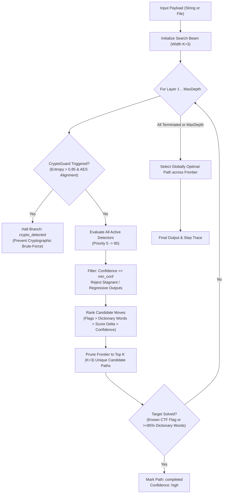

# Universal Layered Decoder: Comprehensive Command & Operational Guide

`layered-decoder` is an automated, multi-layered encoding analysis and peeling engine designed for CTF challenges, malware payload unpacking, and forensic analysis. It continuously detects, tests, scores, and peels stacked layers of obfuscation and encoding using a beam search engine with backtracking, while enforcing safety boundaries against real cryptography.

---

## Table of Contents
1. [Core Concepts & How It Works](#1-core-concepts--how-it-works)
2. [Command-Line Interface (CLI) Reference](#2-command-line-interface-cli-reference)
3. [Supported Encodings & Aliases](#3-supported-encodings--aliases)
4. [Power Combos & Advanced Recipes](#4-power-combos--advanced-recipes)
5. [Real-World Walkthroughs (Challenge Analysis)](#5-real-world-walkthroughs-challenge-analysis)
6. [Python Programmatic API](#6-python-programmatic-api)
7. [Troubleshooting & Stopping Reasons](#7-troubleshooting--stopping-reasons)

---

## 1. Core Concepts & How It Works

### The Beam Search Decoding Engine
Unlike greedy single-path decoders that risk walking into local dead ends on $0.00$-delta steps (such as `Reversal` before `Caesar`), the engine maintains a beam of candidate paths ($K=3$) and explores the top moves across each layer:



### Heuristic Scoring Formula
Every candidate decode is evaluated by `score_text()` on a normalized $[0.0, 1.0]$ scale:

$$\text{Score} = (0.3 \times \text{Printable Ratio}) + (0.3 \times \text{English Word Score}) + (0.2 \times \text{Known Pattern Score}) + (0.2 \times \text{Entropy Score})$$

- **Printable Ratio ($30\%$)**: Fraction of characters within printable ASCII / standard whitespace.
- **English Word Score ($30\%$)**: Percentage of text accounted for by recognized dictionary tokens (including inflections and crypto terms: `welcome`, `future`, `encoded`, `decoded`, `archives`, `cipher`, `message`, `flag`).
- **Known Pattern Score ($20\%$)**: $1.0$ if recognized patterns exist (`flag{...}`, `CTF{...}`, `H4G{...}`, `H3G{...}`, `HTB{...}`, `THM{...}`, `academy{...}`, `TCON{...}`, URLs, JSON).
- **Entropy Score ($20\%$)**: Rewards structured, lower-entropy human-readable text over random high-entropy bytes:
  $$\text{Entropy Score} = \max\left(0.0, 1.0 - \frac{H(\text{text})}{8.0}\right)$$

### Compound Ciphertexts & Changepoint Boundary Search
When multiple independently encoded relays or payloads are concatenated back-to-back with no delimiter (e.g. `relay_a` immediately followed by `relay_b`), traditional whole-string detectors reject the entire input. The engine incorporates an automated segmentation pipeline to detect, split, and recursively peel compound inputs:

1. **Substring & Localized Span Scoring:** Detectors implement localized span discovery (`find_matching_spans`) and density ratios (`match_ratio`) rather than binary whole-string matching.
2. **Character-Class Changepoint Analysis:** Computes sliding-window character-class distribution vectors (clean Base64, Hex, ASCII letters, noise symbols, whitespace, punctuation) and measures Total Variation divergence across candidate positions:
   $$\text{Shift}(i) = \frac{1}{2}\sum_{k} |P_{\text{left}}[k] - P_{\text{right}}[k]|$$
3. **Recursive Per-Segment Decoding:** Candidate boundaries are ranked and tested. Once an optimal boundary is found, each segment recursively enters the full multi-layer decoding loop.
4. **Partial Confidence & Diagnostic Telemetry:** If an input contains localized encodings but cannot be completely solved, the engine surfaces `partial_match_detected: True` and `likely_compound_input: True` with `confidence: low`, signaling compound structure rather than a silent failure.

---

## 2. Command-Line Interface (CLI) Reference

### Invocation Syntax & Typo Tolerance
The CLI accepts inline strings, multi-word arguments, and file paths. Typo-tolerant symlinks ensure seamless execution regardless of common keyboard slips:

```bash
# 1. Inline raw string (quoted)
python layered_decoder "NDg2NTZjNmM2ZjIwNTc2ZjcyNmM2NA=="

# 2. Inline multi-word text (unquoted)
python layered_decoder Gur dhvpx oebja sbk

# 3. Target challenge file (auto-detects files & labeled multi-target blocks)
python layered_decoder sample_chal.txt

# 4. Standard module execution
python -m layered_decoder "SGVsbG8gV29ybGQ="

# 5. Typo tolerance aliases (built-in symlinks)
python layered_decoder "SGVsbG8gV29ybGQ="
python layered_decoder sample_chal.txt
```

### CLI Flag Matrix

| Flag | Short | Description | Example |
| :--- | :--- | :--- | :--- |
| `input_pos` | *positional* | Raw string, unquoted words, or path to target file (auto-detected). | `python layered_decoder sample_chal.txt` |
| `--input` | `-i` | Explicit string input (useful if string starts with `-`). | `python layered_decoder -i "-aGVsbG8="` |
| `--file` | `-f` | Explicitly read target payload from a file. | `python layered_decoder -f payload.txt` |
| `--force` | | Force a specific detector at a designated layer (`LAYER:ENCODING`). Can be specified multiple times. | `--force 1:reversal --force 2:rot24` |
| `--max-depth` | | Maximum number of decode layers to attempt (default: `15`). | `--max-depth 25` |
| `--beam-width` | | Search beam width (default: `3`). | `--beam-width 5` |
| `--flag-prefix` | | Add an exact flag prefix at the start (e.g. `'H4G{'`, repeatable). | `--flag-prefix 'H4G{'` |
| `--try-branches` | | Evaluates parallel split/recombination strategies (odd/even, half split). | `--try-branches -f stream.txt` |
| `--key` | `-k` | Decryption key or password for encrypted envelopes (Fernet / OpenSSL salted). | `python layered_decoder -k "secret" payload.txt` |
| `--wordlist` | `-w` | Wordlist file for brute-forcing encryption keys/passwords. | `python layered_decoder -w rockyou.txt payload.txt` |
| `--bruteforce` | `-B` | Automatically brute-force encrypted envelopes with built-in dictionary. | `python layered_decoder -B payload.txt` |
| `--no-prompt` | | Disable interactive terminal prompt when a key is required. | `python layered_decoder --no-prompt payload.txt` |
| `--verbose` | `-v` | Emits intermediate inputs, outputs, scores, and confidence at every step. | `python layered_decoder -v sample_chal.txt` |
| `--quiet` | `-q` | Emits **only** the final output string (ideal for UNIX pipelines). | `python layered_decoder -q sample_chal.txt` |
| `--json` | | Formats execution trace, layers, steps, and reasons as structured JSON. | `python layered_decoder --json sample_chal.txt \| jq` |

---

## 3. Supported Encodings & Aliases

When using `--force LAYER:ENCODING` or inspecting layers detected by the engine:

| Detector | Priority | Formal Name | Accepted Aliases | Description |
| :--- | :---: | :--- | :--- | :--- |
| **Gzip / Zlib** | 5 | `Gzip/Zlib` | `gzip`, `zlib`, `compression` | Detects raw or Base64-wrapped Gzip/Zlib streams. Capped at 8 MiB decompression limit. |
| **Base64** | 10 | `Base64` | `base64`, `b64` | Standard Base64 RFC 4648 with or without padding. |
| **Base64URL** | 11 | `Base64Url` | `base64url`, `b64url` | URL-safe Base64 (`-` and `_`). |
| **Base32** | 12 | `Base32` | `base32`, `b32` | Standard Base32 uppercase/lowercase with optional padding. |
| **URL Encoding** | 15 | `UrlEncoding` | `url`, `urlencoding` | Standard percent escapes (`%20`, `%21`, etc.). |
| **Hexadecimal** | 20 | `Hex` | `hex` | Hexadecimal byte strings (`48656c6c6f`). |
| **Binary** | 25 | `Binary` | `binary` | 8-bit binary strings (continuous, space-separated, or comma-delimited). |
| **Octal** | 26 | `Octal` | `octal` | 3-digit octal sequences (`110 151`). |
| **ASCII Decimal** | 30 | `AsciiDecimal` | `ascii`, `decimal`, `asciidecimal` | Decimal byte values (`72 105`). |
| **Morse Code** | 40 | `Morse` | `morse` | International Morse code (`.... . .-.. .-.. ---`). |
| **Caesar / ROT-N** | 50 | `Caesar` | `caesar`, `rotation`, `rot13`, `rotn`, `rot<N>` | Family B. Returns all 25 non-identity shifts as candidates and lets the scorer choose. Can force a specific shift (e.g. `rot24`). |
| **Reversal** | 60 | `Reversal` | `reverse`, `reversal` | Inverts string order (`data[::-1]`). |
| **Split & Interleave** | 68 | `SplitInterleave` | `split`, `interleave`, `splitinterleave` | Splits 2-char/1-char pairs into odd/even streams, reverses streams, interleaves, and strips noise. |
| **Interleaved** | 70 | `Interleaved` | `interleaved` | Extracts odd or even stream when one stream contains hidden text. |
| **Symbol-Class Noise** | 72 | `SymbolNoise` | `symbolnoise`, `symbol`, `noise` | Strips irregular junk symbols (`# @ $ % & * ? ! ()`) embedded inside words or prose. |
| **Nth-Char Noise** | 75 | `NthCharNoise` | `nthchar`, `nthcharnoise` | Detects and removes periodic injected noise (strides $n \in [2, 16]$, any offset). |
| **Single-Byte XOR** | 80 | `XorSingleByte` | `xor`, `xorsinglebyte` | Family B. Returns all 255 non-identity keys as candidates; the scorer ranks them. |
| **Vigenere** | 81 | `Vigenere` | `vigenere` | Family B. Guesses key length by index of coincidence, then solves each column independently. Needs ~50+ letters per column. |
| **Repeating-Key XOR** | 82 | `RepeatingKeyXor` | `repeating_key_xor`, `repeatingxor`, `vigenere_xor` | Family B. Cracks repeating-key XOR via Hamming distance ranking, printable ASCII elimination, and English letter chi-squared scoring. |
| **Key Requirement** | 90 | `KeyRequirement` | *(Envelope Detector)* | Detects OpenSSL `Salted__` and Fernet crypto envelopes; halts with `key_required` and specifies necessary decryption info. |
| **CryptoGuard** | 100 | `CryptoGuard` | *(Stop Signal)* | Sample-size-aware entropy + Chi-squared uniformity. Halts structural search rather than guessing real AES/RSA, but still allows the bounded family-B search, since high-entropy bytes are what single-byte XOR looks like. |

---

## 4. Power Combos & Advanced Recipes

### Combo 1: Direct Inline String Decoding
Decode stacked encodings directly from terminal input without creating temporary files:
```bash
# Base64 -> Hex -> Plaintext
python layered_decoder "NDg2NTZjNmM2ZjIwNTc2ZjcyNmM2NA=="

# ROT13 space-separated text (quotes optional)
python layered_decoder Gur dhvpx oebja sbk
```

### Combo 2: Automated Peeling of Multi-Target Challenge Files
Auto-detects multi-line challenge targets (e.g., `past: ...` and `present: ...`), running independent beam search decodes for each target:
```bash
python layered_decoder sample_chal.txt
```

### Combo 3: Pipeline Mode (Quiet Output)
Extract clean output strings directly into system utilities without headers or logs:
```bash
# Decode and copy to clipboard
python layered_decoder -q "SGVsbG8gV29ybGQ=" | xclip -selection clipboard

# Decode challenge file and grab flags
python layered_decoder -q sample_chal.txt | grep -E "flag\{"

# Hash decoded output directly
python layered_decoder -q "SGVsbG8gV29ybGQ=" | sha256sum
```

### Combo 4: JSON Output with `jq` Automation
Extract execution traces, layer sequences, or score deltas for automated solvers:
```bash
# Extract only the final output for each target
python layered_decoder --json sample_chal.txt | jq 'map_values(.final_output)'

# Extract the sequence of detected layers
python layered_decoder --json sample_chal.txt | jq 'map_values(.layers_detected)'

# Inspect step-by-step confidence and score improvements
python layered_decoder --json "NDg2NTZjNmM2ZjIwNTc2ZjcyNmM2NA==" | jq '.steps[] | {layer: .layer_number, detector: .encoding_detected, delta: (.score_after - .score_before)}'
```

### Combo 5: Explicit Layer Forcing Override
When an intermediate layer is intentionally obfuscated or does not form clear dictionary English on its own:
```bash
python layered_decoder \
  "tgjrk#e gjv m@eqnpw$ qv fgg&eqtR u*gxkje?tc owv!pcws t?qh gic?uugo f@gfqep%g pc uk( ukjV." \
  --force 1:reversal \
  --force 2:rot24
```

### Combo 6: Multi-Branch Decoding for Split Streams
When two alternating streams are interleaved:
```bash
python layered_decoder --try-branches -i "SGVsbG8gV29ybGQ="
```

### Combo 7: Concatenated Compound Ciphertext (No Separator)
When two or more distinct relays/encodings are concatenated back-to-back with no delimiter, the engine automatically calculates character-class changepoints, locates boundaries, and peels each segment independently:
```bash
# Decode concatenated relays with no delimiter
python layered_decoder "tgjrk#e gjv m@eqnpw$ qv fgg&eqtR u*gxkje?tc owv!pcws t?qh gic?uugo f@gfqep%g pc uk( ukjV.fXIjM3VVPHRmM0BfSF8+dDBfPXRlMCltYzMjbFdHJXs0fTtIR2wrNGZnIV9ucj8wd2sqX2NiJjRfbUBlb0wlQ0V7I3dHSCEz"

# Quiet output: emits final plaintext for each segment
python layered_decoder -q "tgjrk#e gjv m@eqnpw$ qv fgg&eqtR u*gxkje?tc owv!pcws t?qh gic?uugo f@gfqep%g pc uk( ukjV.fXIjM3VVPHRmM0BfSF8+dDBfPXRlMCltYzMjbFdHJXs0fTtIR2wrNGZnIV9ucj8wd2sqX2NiJjRfbUBlb0wlQ0V7I3dHSCEz"
```

### Combo 8: Compound JSON Telemetry & Segment Extraction
Extract individual segment details, boundary classifications, and layer pipelines:
```bash
# Extract only the final output for each decoded segment
python layered_decoder --json "<compound_payload>" | jq '.segments[] | {layers: .layers_detected, output: .final_output}'

# Check if an unresolved payload was flagged as compound
python layered_decoder --json "<suspect_payload>" | jq '{compound: .likely_compound_input, partial: .partial_match_detected, status: .stopped_reason}'
```

---

## 5. Real-World Walkthroughs (Challenge Analysis)

### Case Study A: Obfuscated Classical Cipher Stream
**Payload:**
```text
tgjrk#e gjv m@eqnpw$ qv fgg&eqtR u*gxkje?tc owv!pcws t?qh gic?uugo f@gfqep%g pc uk( ukjV.
```

**Single Command Execution:**
```bash
python layered_decoder sample_chal.txt
```

**Trace & Step Breakdown:**
```text
=== Target: past ===
[Layer 1] Detected: Reversal (confidence: 0.75)
  Output: .Vjku (ku cp g%peqfg@f oguu?cig hq?t swcp!vwo ct?ejkxg*u Rtqe&ggf vq $wpnqe@m vjg e#krjgt
  Score:  0.39 → 0.39 (+0.00)

[Layer 2] Detected: Caesar (confidence: 0.50)
  Output: .This (is an e%ncode@d mess?age fo?r quan!tum ar?chive*s Proc&eed to $unloc@k the c#ipher
  Score:  0.39 → 0.43 (+0.04)

[Layer 3] Detected: SymbolNoise (confidence: 0.85)
  Output: .This is an encoded message for quantum archives Proceed to unlock the cipher
  Score:  0.43 → 0.70 (+0.27)

=== Final Output [past] ===
.This is an encoded message for quantum archives Proceed to unlock the cipher

Confidence: high
Stopped:    completed
```

**How Beam Search Solved It:**
1. Layer 1 (`Reversal`) produced $+0.00$ score delta. A greedy search might discard it; the beam search retained it in the active frontier ($K=3$).
2. Layer 2 (`Caesar` / ROT-24) produced English words with embedded symbols (`e%ncode@d`, `mess?age`, `quan!tum`, `Proc&eed`).
3. Layer 3 (`SymbolNoise`) recognized the irregular symbol junk class (`#`, `@`, `$`, `%`, `&`, `*`, `?`, `!`, `(`, `)`) and cleanly stripped them, bringing dictionary word coverage to $100\%$.

---

### Case Study B: Multi-Branch Interleaved Stream
**Payload:**
```text
fXIjM3VVPHRmM0BfSF8+dDBfPXRlMCltYzMjbFdHJXs0fTtIR2wrNGZnIV9ucj8wd2sqX2NiJjRfbUBlb0wlQ0V7I3dHSCEz
```

**Single Command Execution:**
```bash
python layered_decoder sample_chal.txt
```

**Trace & Step Breakdown:**
```text
=== Target: present ===
[Layer 1] Detected: Base64 (confidence: 0.90)
  Output: }r#3uU<tf3@_H_>t0_=te0)mc3#lWG%{4};HGl+4fg!_nr?0wk*_cb&4_m@eoL%CE{#wGH!3
  Score:  0.37 → 0.37 (+0.00)

[Layer 2] Detected: SplitInterleave (confidence: 0.90)
  Output: H3G{wELCome_b4ck_wr0ng_fl4G}H4G{W3lc0me_t0_tH3_fUtur3}
  Score:  0.37 → 0.76 (+0.39)

=== Final Output [present] ===
H3G{wELCome_b4ck_wr0ng_fl4G}H4G{W3lc0me_t0_tH3_fUtur3}

Confidence: high
Stopped:    completed
```

**How `SplitInterleave` Solved It:**
1. Layer 1 decoded the Base64 payload into 72 bytes.
2. Layer 2 partitioned the stream into 36 2-character pairs, separated odd pairs (Stream A) and even pairs (Stream B), reversed both streams, interleaved them, and stripped periodic 4th-character noise ($i \equiv 3 \pmod 4$), revealing both target flags:
   - `H3G{wELCome_b4ck_wr0ng_fl4G}` *(Decoy flag)*
   - `H4G{W3lc0me_t0_tH3_fUtur3}` *(Target flag)*

---

### Case Study C: Concatenated Compound Payload (Zero Separator)
**Payload:**
`relay_past` + `relay_present` directly fused into one 185-character string:
```text
tgjrk#e gjv m@eqnpw$ qv fgg&eqtR u*gxkje?tc owv!pcws t?qh gic?uugo f@gfqep%g pc uk( ukjV.fXIjM3VVPHRmM0BfSF8+dDBfPXRlMCltYzMjbFdHJXs0fTtIR2wrNGZnIV9ucj8wd2sqX2NiJjRfbUBlb0wlQ0V7I3dHSCEz
```

**Single Command Execution:**
```bash
python layered_decoder "tgjrk#e gjv m@eqnpw$ qv fgg&eqtR u*gxkje?tc owv!pcws t?qh gic?uugo f@gfqep%g pc uk( ukjV.fXIjM3VVPHRmM0BfSF8+dDBfPXRlMCltYzMjbFdHJXs0fTtIR2wrNGZnIV9ucj8wd2sqX2NiJjRfbUBlb0wlQ0V7I3dHSCEz"
```

**Trace & Step Breakdown:**
```text
=== Compound Payload: 2 Segments Detected ===
--- Segment 1 ---
[Layer 1] Detected: Reversal (confidence: 0.75)
  Output: .Vjku (ku cp g%peqfg@f oguu?cig hq?t swcp!vwo ct?ejkxg*u Rtqe&ggf vq $wpnqe@m vjg e#krjgt
  Score:  0.39 → 0.39 (+0.00)

[Layer 2] Detected: Caesar (confidence: 0.50)
  Output: .This (is an e%ncode@d mess?age fo?r quan!tum ar?chive*s Proc&eed to $unloc@k the c#ipher
  Score:  0.39 → 0.43 (+0.04)

[Layer 3] Detected: SymbolNoise (confidence: 0.85)
  Output: .This is an encoded message for quantum archives Proceed to unlock the cipher
  Score:  0.43 → 0.70 (+0.27)

  Segment 1 Output: .This is an encoded message for quantum archives Proceed to unlock the cipher
  Segment 1 Status: completed (conf: high)

--- Segment 2 ---
[Layer 1] Detected: Base64 (confidence: 0.90)
  Output: }r#3uU<tf3@_H_>t0_=te0)mc3#lWG%{4};HGl+4fg!_nr?0wk*_cb&4_m@eoL%CE{#wGH!3
  Score:  0.37 → 0.37 (+0.00)

[Layer 2] Detected: SplitInterleave (confidence: 0.90)
  Output: H3G{wELCome_b4ck_wr0ng_fl4G}H4G{W3lc0me_t0_tH3_fUtur3}
  Score:  0.37 → 0.76 (+0.39)

  Segment 2 Output: H3G{wELCome_b4ck_wr0ng_fl4G}H4G{W3lc0me_t0_tH3_fUtur3}
  Segment 2 Status: completed (conf: high)

=== Final Output ===
.This is an encoded message for quantum archives Proceed to unlock the cipher
H3G{wELCome_b4ck_wr0ng_fl4G}H4G{W3lc0me_t0_tH3_fUtur3}

Confidence: high
Stopped:    completed
Compound:   True (partial_match: True)
```

**How Changepoint Segmentation Solved It:**
1. A whole-string scan failed to clear the completion bar.
2. The segmentation pre-pass scanned character-class Total Variation divergence and detected a changepoint peak at index $89$ (transition from mixed symbol/whitespace prose to continuous Base64 alphabet).
3. The engine split the payload at index $89$ and independently decoded Segment 1 (`0..89`) and Segment 2 (`89..185`), successfully peeling all layers for both relays.

---

### Case Study D: Multi-Layer Zero-Delta Pipeline (`==bAT9pYEpGW...`) — Reversal $\to$ Caesar $\to$ Base64 $\to$ XOR
**Payload:**
```text
==bAT9pYEpGW151VLuAB1AJW1i0XElqCEA3YL1JWgpAZy5mD
```

**Single Command Execution:**
```bash
python layered_decoder "==bAT9pYEpGW151VLuAB1AJW1i0XElqCEA3YL1JWgpAZy5mD"
```

**Trace & Step Breakdown:**
```text
[Layer 1] Detected: Reversal (confidence: 0.90)
  Output: Dm5yZApgWJ1LY3AECqlEX0i1WJA1BAuLV151WGpEYp9TAb==
  Score:  0.22 → 0.22 (+0.00)

[Layer 2] Detected: Caesar (confidence: 0.50)
  Output: Yh5tUVkbRE1GT3VZXlgZS0d1REV1WVpGQ151RBkZTk9OVw==
  Score:  0.22 → 0.72 (+0.50)

[Layer 3] Detected: Base64 (confidence: 0.90)
  Output: b\x1emQY\x1bDMFOuY^X\x19KGuDEuYZFC^uD\x19\x19NONW
  Score:  0.72 → 0.19 (-0.53)

[Layer 4] Detected: XorSingleByte (confidence: 0.50)
  Output: H4G{s1ngle_str3am_no_split_n33ded}
  Score:  0.19 → 0.80 (+0.61)

=== Final Output ===
H4G{s1ngle_str3am_no_split_n33ded}

Status:     solved
Confidence: high
Stopped:    completed
Compound:   True (partial_match: True)
```

**How the Beam Search Solved It:**
1. **Misplaced Padding Reversal:** The input begins with `==`, which is invalid forward Base64 padding. `ReversalDetector` identifies this tell with $0.90$ confidence. Layer 1 reverses the string, moving `==` to the end. The character-level score shows $+0.00$ improvement, but the beam search retains it in the active frontier as a viable waypoint.
2. **Selective Structural Preemption & Caesar Base64 Lookahead:** Although `Dm5y...==` matches Base64 syntax, raw Base64 decoding produces unscorable high-entropy binary ($< 0.20$). Rather than letting unverified Base64 suppress statistical decoders, the engine allows `Caesar` to evaluate candidate shifts. Shift 21 generates `Yh5t...==`, unmasking valid Base64 that decodes to printable ASCII.
3. **Base64 Decode:** The peeled Base64 reveals a 34-byte single-stream ciphertext.
4. **Single-Byte XOR:** Key `0x2a` (`*`) decrypts the payload to recover the CTF flag: `H4G{s1ngle_str3am_no_split_n33ded}`.

---

## 6. Python Programmatic API

You can embed `LayeredDecoder` directly into automated security tools or solvers.

### Standard Auto-Peeling
```python
from layered_decoder import LayeredDecoder

decoder = LayeredDecoder(max_depth=15, min_confidence=0.3, beam_width=3)
result = decoder.decode("NDg2NTZjNmM2ZjIwNTc2ZjcyNmM2NA==")

print(f"Final output:    {result.final_output}")
print(f"Layers applied:  {' -> '.join(result.layers_detected)}")
print(f"Stopped reason:  {result.stopped_reason}")
print(f"Confidence:      {result.confidence}")
```

### Decoding Compound / Concatenated Ciphertexts
```python
from layered_decoder import LayeredDecoder

decoder = LayeredDecoder()

# Two relays concatenated back-to-back with no separator
compound_payload = (
    "tgjrk#e gjv m@eqnpw$ qv fgg&eqtR u*gxkje?tc owv!pcws t?qh gic?uugo f@gfqep%g pc uk( ukjV."
    "fXIjM3VVPHRmM0BfSF8+dDBfPXRlMCltYzMjbFdHJXs0fTtIR2wrNGZnIV9ucj8wd2sqX2NiJjRfbUBlb0wlQ0V7I3dHSCEz"
)

result = decoder.decode(compound_payload)
print("Is compound:", result.likely_compound_input)
print("Segments found:", len(result.segments))
for idx, seg in enumerate(result.segments, 1):
    print(f"Segment {idx} layers: {seg.layers_detected}")
    print(f"Segment {idx} output: {seg.final_output}")
```

### Forced Layers & Multi-Branching
```python
from layered_decoder import LayeredDecoder

decoder = LayeredDecoder()

# Forcing known layers
result = decoder.decode(
    "tgjrk#e gjv m@eqnpw$ qv fgg&eqtR u*gxkje?tc owv!pcws t?qh gic?uugo f@gfqep%g pc uk( ukjV.",
    forced_layers={1: "reversal", 2: "rot24"}
)

for step in result.steps:
    print(f"[Layer {step.layer_number}] {step.encoding_detected}: {step.score_before:.2f} -> {step.score_after:.2f}")

# Decoding with parallel branch splitting
branch_result = decoder.decode_with_branches(
    "SGVsbG8gV29ybGQ=",
    forced_layers=None
)
print("Recombined output:", branch_result.final_output)
```

---

## 7. Troubleshooting & Stopping Reasons

The `stopped_reason` field and compound diagnostic flags report why decoding halted:

Two independent fields report the outcome. `status` says **how good the answer
is**; `stopped_reason` says **why the search stopped looking**.

| Field | Values | Explanation |
| :--- | :--- | :--- |
| `status` | `solved` | Score $\ge 0.60$ *and* the output looks like a genuine destination: printable, no implausibly long token, corroborated flag. |
| `status` | `partial_decode_low_confidence` | Score $\ge 0.35$ but the finish check failed — likely a partially decoded payload. |
| `status` | `likely_real_cryptography_or_unrecoverable` | Score $< 0.35$, or CryptoGuard fired and nothing better was found. |
| `stopped_reason` | `completed` | The search finished and the result is `solved`. |
| `stopped_reason` | `no_improvement` | The search finished but the result is not `solved`. |
| `stopped_reason` | `crypto_detected` | **CryptoGuard** fired (sample-size-aware entropy plus Chi-squared uniformity, excluding gzip/zlib headers). The bounded family-B search still ran, so a single-byte XOR payload is still cracked; anything deeper was refused. |
| `stopped_reason` | `branch_recombined` | `--try-branches` split, decoded and recombined into a higher-scoring result. |
| `stopped_reason` | `segmented_completed` | Compound input was split and each segment decoded. |
| `confidence` | `high` / `medium` / `low` | Tracks the *evidence*, not just the score. A result built entirely from brute-force guesses is `low` unless unambiguously solved. |
| `likely_compound_input` | `True` / `False` | **Advisory only.** The character-class changepoint signal is not separable in practice — a single base64 payload shows the same $0.75$ shift as two concatenated ones — so treat this as a hint, not a decision. |
| `partial_match_detected` | `True` / `False` | A substantial share (40%–85%) of the input matches an encoding pattern. Note the lower bound is $40\%$, not lower: charsets here are nested (hex is a subset of base64), so any base64 payload sits near $0.31$ hex ratio by chance. |
| `final_bytes_hex` | hex string | The lossless result. `final_output` is a display render; use this for any further processing. |


## 8. Cryptographic Envelope Decryption & Brute-Forcing

The engine identifies standard cryptographic envelopes (**Fernet** and **OpenSSL salted**) by header structure and layout, halting further blind exploration to report the exact requirements. It can then interactively prompt for a key, accept keys via CLI / API, or automatically brute-force passwords.

### Interactive Decryption Prompting
When executing in an interactive terminal and an encrypted envelope is reached, the CLI halts and prompts:

```text
[Layer 1] Detected: Base64 (confidence: 0.90)
  Output: Salted__...

Decryption key required: OpenSSL salted
Evidence: Salted__ magic header followed by salt/payload bytes...
Needed: Original password plus cipher, key derivation method, digest...

[?] Decryption key/password required for OpenSSL salted.
    Enter key/password (or 'b' to brute-force, Enter to skip): 
```

- **Enter password/key**: Decrypts the envelope with the supplied secret and seamlessly resumes peeling inner layers (e.g. `Caesar`, `Base64`, `Gzip`).
- **Enter `b` or `bruteforce`**: Automatically runs dictionary brute-forcing against common passwords.
- **Enter empty / skip**: Exits cleanly with diagnostic report.

---

### Command-Line Flag Recipes

#### 1. Supplying a Known Key or Passphrase
```bash
# Decrypt Fernet or OpenSSL envelope with password
python layered_decoder -k "supersecret" payload.txt

# Extract only the peeled final flag in quiet mode
python layered_decoder -q -k "supersecret" payload.txt
```

#### 2. Automated Dictionary Brute-Forcing
```bash
# Brute-force using the built-in CTF & common passwords dictionary
python layered_decoder -B payload.txt

# Quiet mode: crack and print only the resulting plaintext
python layered_decoder -q -B payload.txt
```

#### 3. Custom Wordlist Brute-Forcing
```bash
# Brute-force using a custom wordlist file (e.g. rockyou.txt)
python layered_decoder -w /usr/share/wordlists/rockyou.txt payload.txt
```

#### 4. JSON Output with Decrypted Continuation
```bash
# Output full execution trace including decryption step as JSON
python layered_decoder --json -k "dragon" payload.txt | jq
```

---

### Programmatic Python API

```python
from layered_decoder import LayeredDecoder

decoder = LayeredDecoder()

# 1. Supply key directly
result = decoder.decode(payload, key="masterkey")
print("Output:", result.final_output)

# 2. Automatically brute-force with built-in dictionary
result = decoder.decode(payload, bruteforce=True)
print("Cracked output:", result.final_output)

# 3. Supply a custom wordlist
result = decoder.decode(payload, wordlist=["cand1", "cand2", "secret_pass"])
```
